# School_District_Analysis

Python School District Standardized Test Analysis

## Background

The chieft Data Scientist for a school district is preparing an all standarized test analysis to provide insight in performance trend and patterns. We will help "The Chief Data Scientist" analyze data on student fundings and standarized test using Python.

## Project Overview

The school board has notified that the students_complete.csv file shows evidence of academic dishonesty; specifically, reading and math grades for Thomas High School ninth graders appear to have been altered.

We have been ask to replace the math and reading scores for Thomas High School with NaNs while keeping the rest of the data intact. Once we’ve replaced the math and reading scores, then to repeat the school district analysis and write up a report to describe how these changes affected the overall analysis.

## Resources

* Data source: students_complete.csv
* Software: Python 3.7.6, JupyterLab 3.4.3

## Schools Audit Results

### Analysis

* How is the district summary affected?

    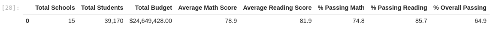

    Figure 1.1 Challenge district symmary

    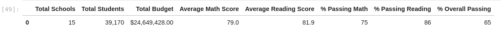

    Figure 1.2 Original district summary

* How is the school summary affected?

    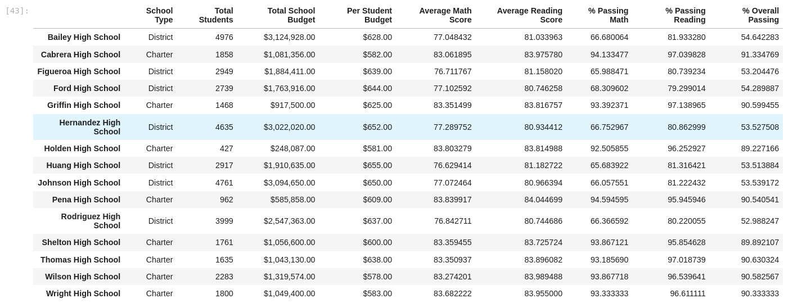

    Figure 1.3 Challenge schools summary

    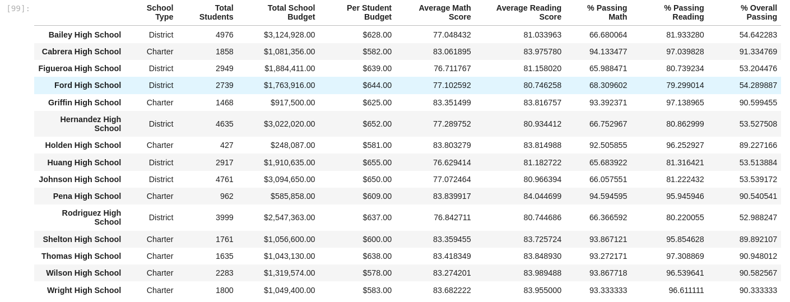

    Figure 1.4 Original school summary

* How does replacing the ninth graders’ math and reading scores affect Thomas High School’s performance relative to the other schools?

    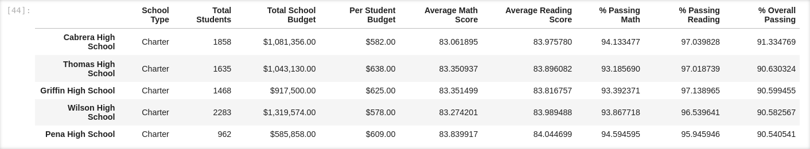

    Figure 1.5 Challenge top schools

    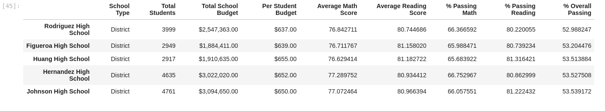

    Figure 1.6 Challenge low schools

    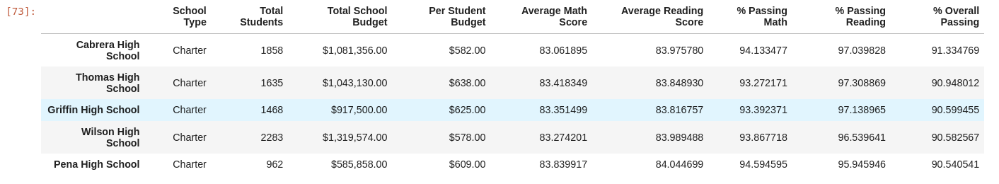

    Figure 1.7 Original top schools

    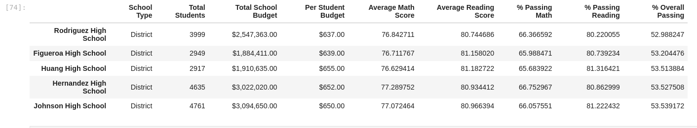

    Figure 1.8 Original low schools

* How does replacing the ninth-grade scores affect the following:

* #### Math and reading scores by grade

    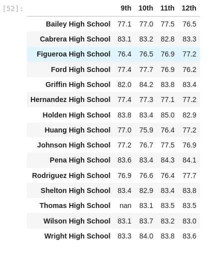

    Figure 1.9 Challenge math scores by grade

    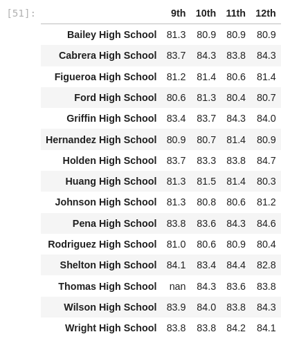

    Figure 1.10 Challenge reading scores by gade

    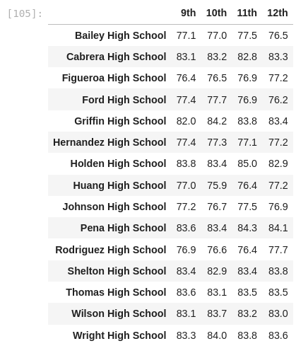

    Figure 1.11 Original math scores by grade

    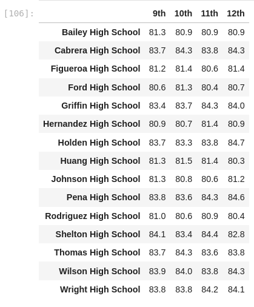

    Figure 1.12 Original reading scores by grade

* #### Scores by school spending

    Small and Medium size schools outperformed larger size schools in math scores, reading scores and in all % to include % Oveall Passing. The larger schools percentage pasing is very differnt and is pulling the overal passing percentage down for district schools.

    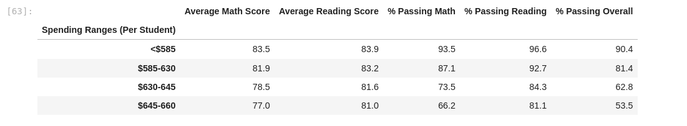

    Figure 1.13 Challenge scores by spending

    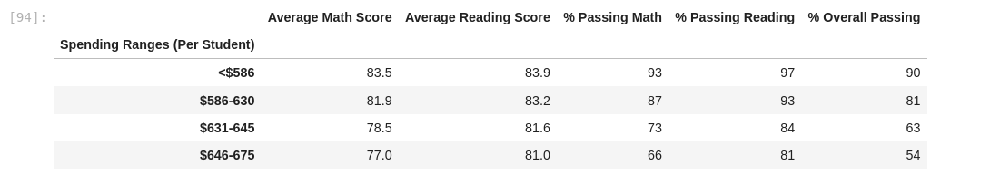

    Figure 1.14 Original scores by spending

* #### Scores by school size

    Small and Medium size schools outperformed larger size schools in math scores, reading scores and in all % to include % Oveall Passing. The larger schools percentage pasing is very differnt and is pulling the overal passing percentage down for district schools.

    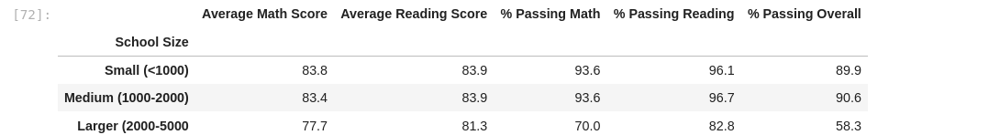

    Figure 1.15 Challenge scores by school size

    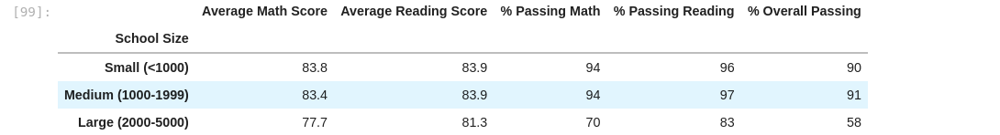

    Figure 1.16 Original scores by school size

* #### Scores by school type

    Charter schools outperformed district schools in math scores, reading scores and in all % to include % Oveall Passing. The percentage pasing math is  very differnt and is pulling the overal passing percentage down for district schools.

    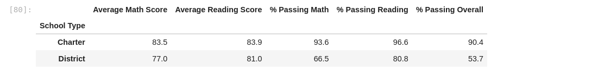

    Figure 1.17 Challenge scores by school type

    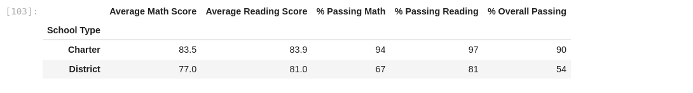

    Figure 1.18 Original scores by school type

## Summary

Statement
* change 1
* change 2
* change 3
* change 4

## References

[Markdown 1](https://docs.github.com/en/get-started/writing-on-github/getting-started-with-writing-and-formatting-on-github/basic-writing-and-formatting-syntax)

[Markdown 2](https://www.markdownguide.org/basic-syntax/)

