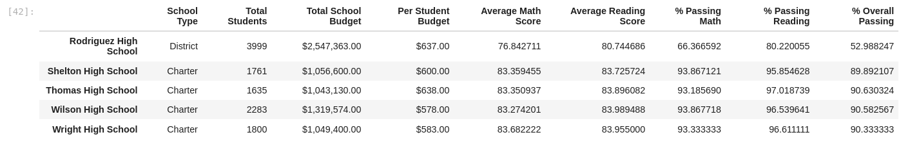

# School_District_Analysis

## Background

Python School District Standardized Test Analysis

## Project Overview

 The purpose of this project is to analyze a school district's standardized test and student funding to provide insight into performance trends and patterns. Due to the potential dishonesty from one group of students, our client has requested to perform the analysis twice. One analysis included the entire set of data and the second analysis replaced the scores for a specific group/grade. A complete analysis and assessment on the implications of replacing or omitting data is provided as part of this project.

## Resources

* Data source: students_complete.csv
* Software: Python 3.7.6, JupyterLab 3.4.3

## Schools Audit Results

### Analysis

 - At the district level, there was no major impact on the overall results when we replaced the 9th grade scores from Thomas High School. When we compared Fig 1.1 and Fig 1.2, the overall passing percentage only changed by 0.1%. This could be because the scores for the ninth grade for Thomas High School represent a small fraction of the entire population of the school district.

  

Figure 1.1 District summary after score replacement.

 

Figure 1.2 District summary original analysis.

 

 - Something similar happened when we compared the data for the School summary in Fig 1.3 and Fig 1.4. There were no major changes on the results on the school summary DataFrame. The overall passing score for Thomas High School only changed by 0.32%, again this could be because the ninth grade population is a small fraction of the whole district as we observed in the district summary analysis above.
  
   

Figure 1.3 Schools summary after score replacement.

 

Figure 1.4 School summary original analysis.

   

 - Replacing the scores with "nan" as shown in Fig 1.6, caused the overall passing score for Thomas High School to drop to **65.1%** (Fig 1.6). When we compared (Fig 1.5 - 1.7), Thomas High School was dropped from the top 5 schools. However when we recalculated the percentage of students who passed math, passed reading, and passed both math and reading for Thomas High School the school's overall passing rate improved to **90.63%** (Fig 1.7). Thomas High School returned to the **2nd position** of the top 5 schools. Therefore, we can conclude that the change after we recalculated the % passing did not affect THS in relation to the other schools.
 
 

Figure 1.5 District top schools original analysis.

 

Figure 1.6 Thomas High School %Passing after replacement

 

Figure 1.7 Thomas High School %Passing recalculated.

 

#### Math and reading scores by grade
  
- The replacement of the ninth grade score with "nan" (Fig 1.8) caused the omission of the entire ninth grade population from all the calculations, therefore this specific group did not have individual or collective scores and percentages to be measured against same graders of other schools or the district overall scores. However, when we compared the entire Thomas High School, the math and reading scores increased by **0.06%** and **0.1%** respectively after we replaced the score for the ninth grade as shown in (Figure 1.8 - 1.11).

 

Figure 1.8 Schools math scores by grade after replacement.

 

Figure 1.9 Schools reading scores by grade after replacement.

 

Figure 1.10 Math scores by grade original analysis.

 

Figure 1.11 Reading scores by grade original analysis.

 

#### Scores by school spending

- The average scores and the %passing math, %passing reading, and %passing overall did not increase as spending per student increased. Schools that spent less per student outperformed schools that spent more per student. As we can see in Fig 1.12 and 1.13, the schools that spent $645 - $660 per student had considerably lower scores compared to schools that spent <$586 which had the highest overall scores. Therefore, there were other factors other than budget that affected the schools' performace, for example we have to take into consideration the school size or type.  

Figure 1.12 School scores by spending after replacement.

  
 

Figure 1.13 School scores by spending original analysis.
 
  

#### Scores by school size

- Small and Medium size schools outperformed larger size schools in math scores, reading scores, and in all % to include the % Overall Passing. The larger schools percentage passing is very different and is pulling the overall passing percentage down for district schools. (Fig 1.14 - 1.15)

 

Figure 1.14 Scores by school size after replacement.

 

Figure 1.15 Scores by school size original analysis.

 

#### Scores by school type

- Charter schools outperformed district schools in math scores, reading scores, and in all % to include % Overall Passing. The percentage passing math is  very different and is pulling the overall passing percentage down for district schools.(Fig 1.16 -1.17)

 

Figure 1.16 Scores by school type after replacement.

 

Figure 1.17 Scores by school type original analysis.

 

## Summary

The replacement of the scores for Thomas High school had minimal effect on the school ranking. At first, the school was dropped from the top 5 schools in the district. However, when we recalculated the percentage of students who passed math, passed reading, and passed both math and reading for Thomas High School after the replacement of scores, the school returned to the **second place**. Below is a summary of changes we observed during the analysis.
    
* The overall district summary changed by **0.1%** for Thomas High school.

* The overall per school summary dropped by **0.32%** for Thomas High School.

* Thomas High school math and reading scores increased by 0.06% and 0.1% respectively after we replaced the score for the ninth grade.

* The overall passing score for Thomas High School dropped to 65% when we replace the scores but improved to **90.63%** after  we recalculated the percentage of students who passed math, passed reading, and passed both math and reading for Thomas High School.

The analysis showed that there are other factors that are influencing the passing scores for the schools and the district. Smaller and medium sized schools performed better than larger schools. Additionally, charter schools performed better than the district schools in general regardless of the spending per student. 

 

## References

[Markdown 1](https://docs.github.com/en/get-started/writing-on-github/getting-started-with-writing-and-formatting-on-github/basic-writing-and-formatting-syntax)

[Markdown 2](https://www.markdownguide.org/basic-syntax/)
